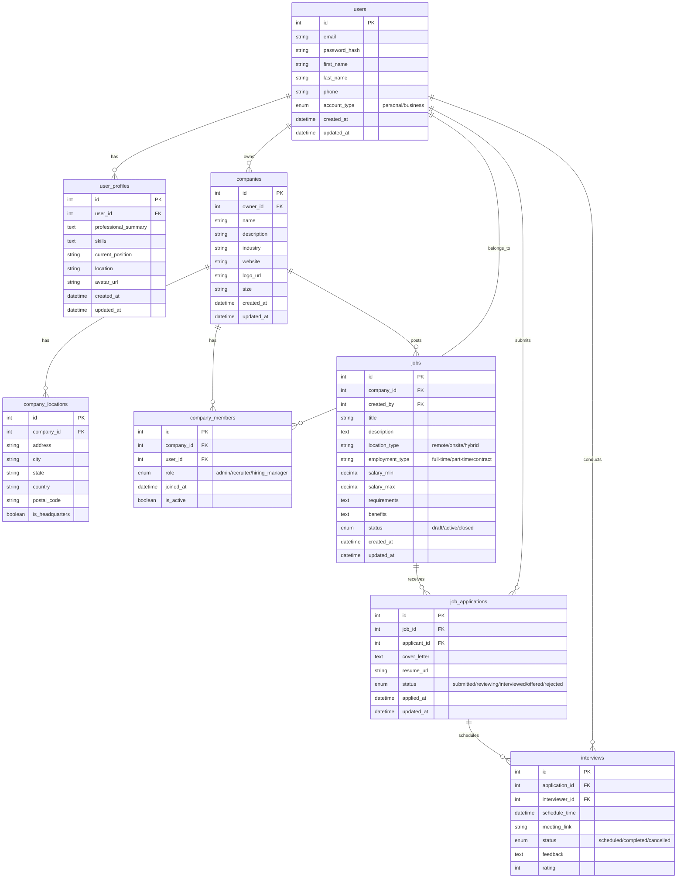

# Database

---

<div className="w-[400px] mx-auto">

```mermaid
erDiagram
    users {
        int id PK
        string email
        string password_hash
        string first_name
        string last_name
        string phone
        enum account_type "personal/business"
        datetime created_at
        datetime updated_at
    }

    user_profiles {
        int id PK
        int user_id FK
        text professional_summary
        text skills
        string current_position
        string location
        string avatar_url
        datetime created_at
        datetime updated_at
    }

    companies {
        int id PK
        int owner_id FK
        string name
        string description
        string industry
        string website
        string logo_url
        string size
        datetime created_at
        datetime updated_at
    }

    company_locations {
        int id PK
        int company_id FK
        string address
        string city
        string state
        string country
        string postal_code
        boolean is_headquarters
    }

    company_members {
        int id PK
        int company_id FK
        int user_id FK
        enum role "admin/recruiter/hiring_manager"
        datetime joined_at
        boolean is_active
    }

    jobs {
        int id PK
        int company_id FK
        int created_by FK
        string title
        text description
        string location_type "remote/onsite/hybrid"
        string employment_type "full-time/part-time/contract"
        decimal salary_min
        decimal salary_max
        text requirements
        text benefits
        enum status "draft/active/closed"
        datetime created_at
        datetime updated_at
    }

    job_applications {
        int id PK
        int job_id FK
        int applicant_id FK
        text cover_letter
        string resume_url
        enum status "submitted/reviewing/interviewed/offered/rejected"
        datetime applied_at
        datetime updated_at
    }

    interviews {
        int id PK
        int application_id FK
        int interviewer_id FK
        datetime schedule_time
        string meeting_link
        enum status "scheduled/completed/cancelled"
        text feedback
        int rating
    }

    users ||--o{ user_profiles : has
    users ||--o{ companies : owns
    users ||--o{ company_members : belongs_to
    users ||--o{ job_applications : submits
    users ||--o{ interviews : conducts

    companies ||--o{ company_locations : has
    companies ||--o{ company_members : has
    companies ||--o{ jobs : posts

    jobs ||--o{ job_applications : receives
    job_applications ||--o{ interviews : schedules

```
</div>
```
