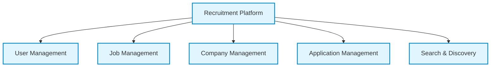
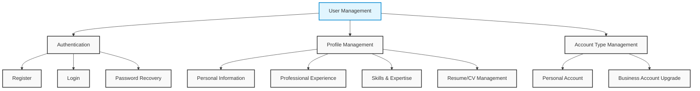
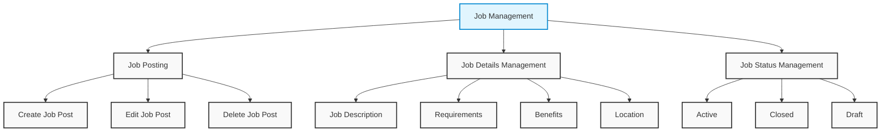
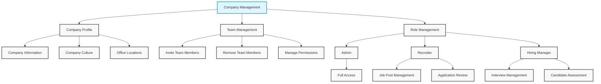
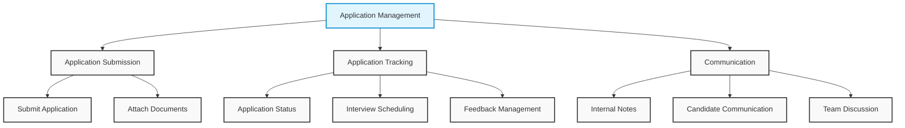
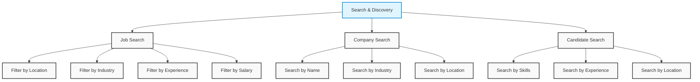

# Modules

---

## Overview

```mermaid
graph TD
    A[Recruitment Platform] --> B[User Management]
    A --> C[Job Management]
    A --> D[Company Management]
    A --> E[Application Management]
    A --> F[Search & Discovery]

    classDef default fill:#f9f9f9,stroke:#333,stroke-width:2px
    classDef module fill:#e1f5fe,stroke:#0288d1,stroke-width:2px
    class A,B,C,D,E,F module
```

---

## User Management

```mermaid
graph TD
    B[User Management] --> B1[Authentication]
    B --> B2[Profile Management]
    B --> B3[Account Type Management]

    B1 --> B1.1[Register]
    B1 --> B1.2[Login]
    B1 --> B1.3[Password Recovery]

    B2 --> B2.1[Personal Information]
    B2 --> B2.2[Professional Experience]
    B2 --> B2.3[Skills & Expertise]
    B2 --> B2.4[Resume/CV Management]

    B3 --> B3.1[Personal Account]
    B3 --> B3.2[Business Account Upgrade]

    classDef default fill:#f9f9f9,stroke:#333,stroke-width:2px
    classDef module fill:#e1f5fe,stroke:#0288d1,stroke-width:2px
    class B module
```

---

## Job Management

```mermaid
graph TD
    C[Job Management] --> C1[Job Posting]
    C --> C2[Job Details Management]
    C --> C3[Job Status Management]

    C1 --> C1.1[Create Job Post]
    C1 --> C1.2[Edit Job Post]
    C1 --> C1.3[Delete Job Post]

    C2 --> C2.1[Job Description]
    C2 --> C2.2[Requirements]
    C2 --> C2.3[Benefits]
    C2 --> C2.4[Location]

    C3 --> C3.1[Active]
    C3 --> C3.2[Closed]
    C3 --> C3.3[Draft]

    classDef default fill:#f9f9f9,stroke:#333,stroke-width:2px
    classDef module fill:#e1f5fe,stroke:#0288d1,stroke-width:2px
    class C module
```

---

## Company Management

```mermaid
graph TD
    D[Company Management] --> D1[Company Profile]
    D --> D2[Team Management]
    D --> D3[Role Management]

    D1 --> D1.1[Company Information]
    D1 --> D1.2[Company Culture]
    D1 --> D1.3[Office Locations]

    D2 --> D2.1[Invite Team Members]
    D2 --> D2.2[Remove Team Members]
    D2 --> D2.3[Manage Permissions]

    D3 --> D3.1[Admin]
    D3.1 --> D3.1.1[Full Access]
    D3 --> D3.2[Recruiter]
    D3.2 --> D3.2.1[Job Post Management]
    D3.2 --> D3.2.2[Application Review]
    D3 --> D3.3[Hiring Manager]
    D3.3 --> D3.3.1[Interview Management]
    D3.3 --> D3.3.2[Candidate Assessment]

    classDef default fill:#f9f9f9,stroke:#333,stroke-width:2px
    classDef module fill:#e1f5fe,stroke:#0288d1,stroke-width:2px
    class D module
```

---

## Application Management

```mermaid
graph TD
    E[Application Management] --> E1[Application Submission]
    E --> E2[Application Tracking]
    E --> E3[Communication]

    E1 --> E1.1[Submit Application]
    E1 --> E1.2[Attach Documents]

    E2 --> E2.1[Application Status]
    E2 --> E2.2[Interview Scheduling]
    E2 --> E2.3[Feedback Management]

    E3 --> E3.1[Internal Notes]
    E3 --> E3.2[Candidate Communication]
    E3 --> E3.3[Team Discussion]

    classDef default fill:#f9f9f9,stroke:#333,stroke-width:2px
    classDef module fill:#e1f5fe,stroke:#0288d1,stroke-width:2px
    class E module
```

---

## Search & Discovery

```mermaid
graph TD
    F[Search & Discovery] --> F1[Job Search]
    F --> F2[Company Search]
    F --> F3[Candidate Search]

    F1 --> F1.1[Filter by Location]
    F1 --> F1.2[Filter by Industry]
    F1 --> F1.3[Filter by Experience]
    F1 --> F1.4[Filter by Salary]

    F2 --> F2.1[Search by Name]
    F2 --> F2.2[Search by Industry]
    F2 --> F2.3[Search by Location]

    F3 --> F3.1[Search by Skills]
    F3 --> F3.2[Search by Experience]
    F3 --> F3.3[Search by Location]

    classDef default fill:#f9f9f9,stroke:#333,stroke-width:2px
    classDef module fill:#e1f5fe,stroke:#0288d1,stroke-width:2px
    class F module
```
