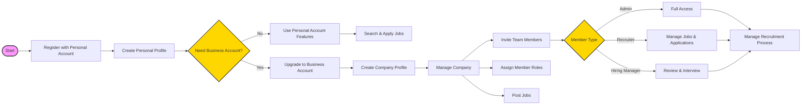

# User Flows

---

```mermaid
flowchart LR
    Start([Start]) --> Register[Register with Personal Account]
    Register --> CreateProfile[Create Personal Profile]
    CreateProfile --> NeedBusiness{Need Business Account?}
    
    NeedBusiness -->|No| UsePersonal[Use Personal Account Features]
    UsePersonal --> SearchJobs[Search & Apply Jobs]
    
    NeedBusiness -->|Yes| UpgradeBusiness[Upgrade to Business Account]
    UpgradeBusiness --> CreateCompany[Create Company Profile]
    
    CreateCompany --> ManageCompany[Manage Company]
    ManageCompany --> InviteMembers[Invite Team Members]
    ManageCompany --> AssignRoles[Assign Member Roles]
    ManageCompany --> PostJobs[Post Jobs]
    
    InviteMembers --> MemberTypes{Member Type}
    MemberTypes -->|Admin| AdminPermissions[Full Access]
    MemberTypes -->|Recruiter| RecruiterPermissions[Manage Jobs & Applications]
    MemberTypes -->|Hiring Manager| HiringPermissions[Review & Interview]
    
    AdminPermissions & RecruiterPermissions & HiringPermissions --> ManageRecruitment[Manage Recruitment Process]
    
    style Start fill:#f9f,stroke:#333,stroke-width:2px
    style NeedBusiness fill:#ffd700,stroke:#333,stroke-width:2px
    style MemberTypes fill:#ffd700,stroke:#333,stroke-width:2px
```
